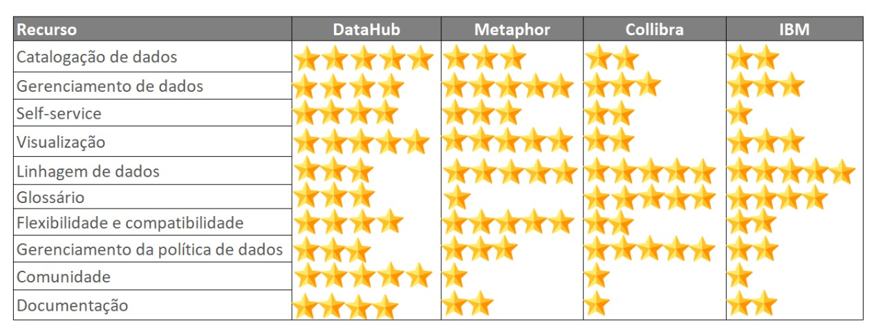
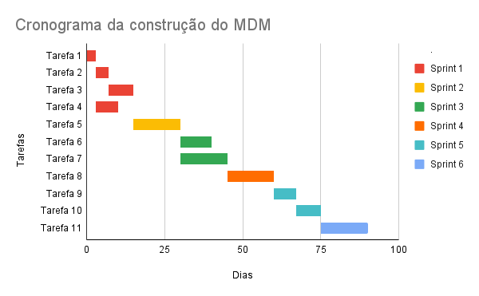

# Kubernetes pipeline agnostico

Esse trabalho é baseado no artigo original [upyter Notebook & Spark on Kubernetes](https://towardsdatascience.com/jupyter-notebook-spark-on-kubernetes-880af7e06351). Em nossa implementação optamos por utilizar [Microk8s] (https://microk8s.io/) desenvolvido pela Canonical que ao contrário do Minikube suporta multiplos nodes e pode ser utilizando em produção.


## Aqui vamos descrever os pre-requisitos para rodar o projeto.

1. Um cluster kubernetes Microk8s com RBAC habilitado (Role, Subject, RoleBinding) [RBAC](https://medium.com/containerum/configuring-permissions-in-kubernetes-with-rbac-a456a9717d5d).Utilizaremos também um volume persistente para habilitar o volume persistente no Microk8s utilize o seguinte código.

   <code>
   microk8s enable hostpath-storage 
   </code>

2. Cria um volume persistencia dos dados. O primeiro código verifca os pvc existentes, o segundo código cria o volume persistente.

   <code>
   microk8s  kubectl get pv  
   </code>
   
   <code>
    microk8s kubectl apply -f dev/minio/persistentvolumeclaim.yaml 
   </code>

3. Minio é um objeto storage compativel com S3.
    
    <code>   
    microk8s kubectl create -f dev/minio/minio.yaml
    </code>
    
3. Instala o JDK para gerar as imagens localmente
    
    <code>
     apt install openjdk-11-jre-headless 
    </code>
    
4. Instala o poetry 
   
   <code>
     curl -sSL https://install.python-poetry.org | python3 -
   </code>
   
5. Cria um namespace ml-data-engg
   
   <code>
     microk8s kubectl create namespace ml-data-engg
   </code>

Para os testes vamos utilizar os dados de...


## Instalando o Spark localmente para gerar as imagens docker.

- Download latest version of spark from [here](https://dlcdn.apache.org/spark/spark-3.3.0/spark-3.3.0-bin-hadoop3.tgz). Using spark 3.3.0 with scala-12 and hadoop-3.3 in this example.


-  Add additional jars needed for aws-sdk and hadoop-3 (this will ensure that these JARs get copied over to docker image that we would be building under the section build base image)
``` 
tar xvzf spark-3.3.0-bin-hadoop3.tgz
sudo mv spark-3.3.0-bin-hadoop3 /usr/local/spark-3.3
export SPARK_HOME=/usr/local/spark-3.3
export PATH=$PATH:$SPARK_HOME/bin

cd /usr/local/spark-3.3/jars
wget https://repo1.maven.org/maven2/org/apache/hadoop/hadoop-aws/3.3.4/hadoop-aws-3.3.4.jar
wget https://repo1.maven.org/maven2/com/amazonaws/aws-java-sdk-bundle/1.12.298/aws-java-sdk-bundle-1.12.298.jar
```
 
- Make a few edits to the default dockerfiles and jars provided by spark. Edit the file under $SPARK_HOME/kubernetes/dockerfiles/spark/bindings/python/Dockerfile. Add entry to install pyspark
```
RUN mkdir ${SPARK_HOME}/python
RUN apt-get update && \
    apt install -y python3 python3-pip && \
    pip3 install --upgrade pip setuptools && \
    pip3 install pyspark==3.3.0 py4j==0.10.9.5 && \  <-- Add this line
    # Removed the .cache to save space
    rm -r /root/.cache && rm -rf /var/cache/apt/*
```


- Add minio secrets and reference it later
```
microk8s kubectl create secret generic minio-api-client-credentials  \
    --from-literal=MINIO_HOST_URL="<MINIO_SVC_HOST_NAME>.minio:9000" \
    --from-literal=MINIO_HTTP_ENDPOINT="http://<MINIO_SVC_HOST_NAME>.minio:9000" \
    --from-literal=MINIO_ACCESS_KEY="YourAccessKey" \
    --from-literal=MINIO_SECRET_KEY="YourSecretKey" \
    -n ml-data-engg 
```


## Local testing and base images

### Quick Test Locally (to check if spark JARs and minio are working fine)
```
poetry install
export SPARK_LOCAL_IP=<Local IP>
spark-submit spark_on_k8s/main.py --master=local[1]
```

### Build Base Image
```
chmod +x ./dev/base_spark_image/build_base_image.sh && ./dev/base_spark_image/build_base_image.sh
```


### Build Spark Notebook Image
```
chmod +x ./dev/base_notebook_image/build_spark_notebook.sh && ./dev/base_notebook_image/build_spark_notebook.sh
```

### Build GPU Spark Notebook
```
chmod +x ./dev/base_notebook_image/build_gpu_spark_notebook.sh && ./dev/base_notebook_image/build_gpu_spark_notebook.sh
```


### Another option - reuse gpu-jupyter image from iot-salzburg
- Refer: [iot-salzburg/gpu-jupyter](https://github.com/iot-salzburg/gpu-jupyter#build-your-own-image)
```
cd $HOME
git clone https://github.com/iot-salzburg/gpu-jupyter.git
git checkout v1.4_cuda-11.6_ubuntu-20.04
./generate-Dockerfile.sh --slim --python-only
cp -r .build <Path to current project>
```
- Add Spark related dependencies to it and run
```
docker build -t datastoryteller/gpu-jupyter-spark:v1.4_cuda-11.7_ubuntu-22.04_slim .build/
docker push datastoryteller/gpu-jupyter-spark:v1.4_cuda-11.7_ubuntu-22.04_slim
```


## Deploy Spark Notebook on Kubernetes
Using namepsace ml-data-engg. Change namespace as needed for your use case. Make sure the namespace exists.
Inspired by blog posted by [Itay Bittan](https://towardsdatascience.com/jupyter-notebook-spark-on-kubernetes-880af7e06351)
- Select `datastoryteller/spark-notebook:3.3.0-scala_2.12-jre_17-slim-bullseye` for regular spark-notebook or
- `datastoryteller/gpu-spark-notebook:v1.4_cuda-11.7_ubuntu-22.04_slim_spark-3.3` for gpu enabled notebook. In this case make sure you are deploying on a node with gpu
```
kubectl apply -f dev/service-account.yaml
kubectl apply -f dev/spark-notebook.yaml -n ml-data-engg
kubectl apply -f dev/gpu-spark-notebook.yaml -n ml-data-engg
```
See sample notebook under [here](notebook/spark-k8s-test.ipynb). If everything works fine, you should get a monitor like below


### Test Spark Image
```
$SPARK_HOME/bin/spark-submit \
    --master k8s://https://<KUBE CLUSTER IP>:16443 \
    --deploy-mode cluster \
    --name spark-submit-examples-sparkpi \
    --conf spark.executor.instances=3 \
    --conf spark.kubernetes.authenticate.driver.serviceAccountName=datastoryteller-ml-data-deployer \
    --conf spark.kubernetes.namespace=ml-data-engg \
    --class org.apache.spark.examples.SparkPi \
    --conf spark.kubernetes.container.image=datastoryteller/spark:3.3.0-scala_2.12-jre_17-slim-bullseye \
     local:///opt/spark/examples/jars/spark-examples_2.12-3.3.0.jar 80
```

### Cleaning up if needed
`kubectl delete pods -l  spark-app-name=test-app -n ml-data-engg`
`kubectl delete pods -l  spark-app-name=pyspark-submit-test -n ml-data-engg`


## Using Spark-Operator on k8s

### Install using helm
```
# https://github.com/GoogleCloudPlatform/spark-on-k8s-operator
helm repo add spark-operator https://googlecloudplatform.github.io/spark-on-k8s-operator
helm install spark-operator spark-operator/spark-operator --namespace spark-operator --create-namespace 
```

### Build and test Pyspark code using spark operator
Note:- Uses the service account that is defined when `kubectl apply -f dev/service-account.yaml` is run
```
poetry export --without-hashes --format=requirements.txt > dev/requirements.txt
chmod +x ./dev/spark-operator-create-driver.sh && ./dev/spark-operator-create-driver.sh
kubectl apply -f dev/spark-operator-python-test.yaml -n ml-data-engg
```
Unlike spark notebook above where sparkmonitor is currently not supported on scala 2.13, operator seems to work fine on both scala-2.12 and scala-2.13 images


## Using spark-submit on k8s instead of using operator
```
$SPARK_HOME/bin/spark-submit \
    --master k8s://https://<KUBE CLUSTER IP>:16443 \
    --deploy-mode cluster \
    --name pyspark-submit-test \
    --conf spark.executor.instances=3 \
    --conf spark.driver.cores=1  \
    --conf spark.driver.memory=1g \
    --conf spark.executor.cores=2 \
    --conf spark.executor.memory=2g  \
    --conf spark.kubernetes.authenticate.driver.serviceAccountName=datastoryteller-ml-data-deployer \
    --conf spark.kubernetes.namespace=ml-data-engg \
    --conf spark.kubernetes.container.image=datastoryteller/spark-operator-driver:3.3.0-scala_2.12-jre_17-slim-bullseye \
    --conf spark.kubernetes.container.image.pullPolicy=Always \
    --conf spark.kubernetes.driver.secretKeyRef.S3_HOST_URL=minio-api-client-credentials:MINIO_HOST_URL \
    --conf spark.kubernetes.driver.secretKeyRef.AWS_ACCESS_KEY_ID=minio-api-client-credentials:MINIO_ACCESS_KEY \
    --conf spark.kubernetes.driver.secretKeyRef.AWS_SECRET_ACCESS_KEY=minio-api-client-credentials:MINIO_SECRET_KEY \
    --conf spark.kubernetes.executor.secretKeyRef.S3_HOST_URL=minio-api-client-credentials:MINIO_HOST_URL \
    --conf spark.kubernetes.executor.secretKeyRef.AWS_ACCESS_KEY_ID=minio-api-client-credentials:MINIO_ACCESS_KEY \
    --conf spark.kubernetes.executor.secretKeyRef.AWS_SECRET_ACCESS_KEY=minio-api-client-credentials:MINIO_SECRET_KEY \
     local:///app/spark_on_k8s/main.py
```
## Queries

As queries e seus resultados estão presentes na pasta queries.

# Comparativo de ferramentas para governança de dados

## Ferramentas escolhidas

Dentre as inúmeras ferramentas oferecidas no mercado, optou-se pela escolha das seguintes: Metaphor, Collibra, IBM e DataHub. Nas próximas seções, encontra-se um breve resumo de cada uma das supracitadas, bem como a pontuação de algumas características, seguidas de um quadro comparativo e a recomendação da equipe dentre as candidatas avaliadas:

### Metaphor

Metaphor é uma plataforma de metadata que serve como um sistema de registro para o ecossistema de dados de uma organização. Fornece visibilidade total do cenário de dados e empodera os produtores e consumidores a trabalhar com mais eficiência e efetividade.
Através de sua web interface, o Metaphor analisa os metadados técnicos e apresenta aos usuários uma maneira otimizada de busca pelos datasets de seu interesse, bem como estatísticas, linhagem e utilização.
Além disso, a plataforma deixa os usuários criarem pequenos posts sobre como eles utilizam os dados e disponibilizarem para seus colegas de uma forma mais familiar, através de uma linguagem de negócios e não técnica.

- **Glossário**: foge da premissa da criação de um glossário, através da criação de cards (ou posts) em que os usuários descrevem como fazem a utilização dos dados em questão e deixam expostos publicamente para quem quiser consultar, evitando qualquer tipo de linguajar técnico;

- **Linhagem**: inferida automaticamente de qualquer sistema que estiver conectado e informa aos usuários sobre a origem e destino do dado. Também deixa claro o upstream e downstream da linhagem para investigação, de forma gráfica;

- **Catalogação de dados**: permite atribuir tags a datasets, dashboards e documentos baseado na curadoria do dado, domínio do negócio ou com base no produtor;

- **Gerenciamento de metadados**: o Metaphor faz a descoberta de todos os metadados e deixa-os de forma apresentável;

- **Visualização**: oferece várias opções de visualização, principalmente nas streams de linhagem dos dados;

- **Flexibilidade e compatibilidade**: muito flexível, compatível com os principais ambientes cloud do mercado ou suas aplicações.

### Collibra

O software da Collibra ajuda as organizações a manterem a qualidade e segurança de seus dados. É uma solução robusta, que inclui o gerenciamento para o Data Steward, gerenciamento de dados de referência, centralização de políticas, glossário de dados e workflows intuitivos. Também fornece insights para garantir que se adequa às leis de proteção de dados.

- **Glossário**: possui suporte a glossário de negócios;

- **Linhagem**: o Collibra Data Lineage automaticamente mapeia as relações entre dados para mostrar o fluxo de sistema a sistema e como os datasets são construídos, agregados, fornecidos e usados;

- **Catalogação de dados**: tem um produto de catálogo de dados separado que pode ser linkado ao glossário e às políticas de governança. A catalogação ocorre através de crawls e machine learning dentro das fontes de dados registradas;

- **Gerenciamento de metadados**: o catálogo de dados permite aos usuários descobrir, extrair e entregar metadados de uma gama de sistemas ERP e CRM;

- **Visualização**: fornece a visualização da linhagem de dados de ponta a ponta;

- **Flexibilidade e compatibilidade**: fornece buscas contextuais, bons workflows e dashboards, além de templates para relatórios.

### IBM

A solução da IBM protege a confidencialidade de dados, integridade e disponibilidade através de todas as ferramentas do seu ecossistema, de forma a assegurar que é compatível com as regulações ao redor do mundo. Funciona tanto com dados estruturados quanto os desestruturados. Essa centralização auxilia na criação de uma linguagem de negócios unificada, corroborada às regras, políticas e rastreio das fontes de dados.

- **Glossário**: suporta glossário de negócios através do Watson Knowledge Catalog;

- **Linhagem**: rastreia a linhagem de dados através da classificação e criação de perfil automático;

- **Catalogação de dados**: o Watson Knowledge Catalog executa algoritmos de machine learning e coleta metadados e ativos;

- **Gerenciamento de metadados**: possui apenas gerenciamento de dados através do InfoSphere Optim;

- **Visualização**: fornece visualização do perfil de dados, gráficos e estatísticas;

- **Flexibilidade e compatibilidade**: possui uma vasta gama de implantações na IBM Cloud.

### DataHub

O DataHub é uma plataforma de governança de dados low code com foco na catalogação dos metadados utilizados nos conjuntos de dados das organizações. A plataforma busca descomplicar o processo de obtenção e compreensão dos metadados, permitindo que usuários não técnicos consigam facilmente encontrar as informações que buscam. O DataHub permite com que o time de dados das organizações possa:

- Gerenciar os níveis de acessos dos usuários aos conjuntos de dados;
- Criar grupos de curadoria para determinado conjunto de dados;
- Identificar quais são os metadados e data sets mais consumidos;
- Anexar documentos da arquitetura do ambiente;
- Disponibilizar a linhagem dos dados; e
- Disponibilizar as propriedades do armazenamento.

- **Glossário**: permite a vinculação de TAGs, termos e documentações que têm como objetivo orientar a utilização dos dados;

- **Linhagem**: permite a identificação automática dos relacionamentos existentes entre os dados. Há ainda a possibilidade de a linhagem ser construída manualmente dentro do próprio DataHub ou em ferramentas externas e anexada no DataHub;

- **Catalogação de dados**: permite conexão nativa com as principais ferramentas de data storage disponíveis no mercado, como o HDFS e Amazon S3. Através desta conexão ocorrem as inferências automáticas dos metadados utilizados no conjunto de dados. Após as inferências, o time responsável pela curadoria dos dados pode realizar modificações com base nas necessidades existentes;

- **Gerenciamento de metadados**: possui uma série de recursos nativos que permitem o time de dados das organizações realizar os processos de data quality e data governance;

- **Visualização**: permite a visualização tabular dos metadados, bem como a visualização gráfica da linhagem;

- **Flexibilidade e compatibilidade**: alta flexibilidade e compatibilidade com as principais ferramentas de data storage do mercado.

## Quadro comparativo

De acordo com os argumentos apresentados na seção anterior, apresenta-se abaixo a tabela comparativa entre as ferramentas citadas e suas funcionalidades:



## Recomendação dos integrantes do grupo

Após estudo das ferramentas de Data Governance exposto acima, optou-se por prosseguir com o DataHub neste projeto, tendo em vista que é uma ferramenta gratuita, open source, possui uma comunidade difusa e ativa, além de ser de fácil implantação e oferecer boa parte das funcionalidades que são entregues apenas na versão premium de seus concorrentes. 

# Construção do MDM

Para a construção do MDM, acredita-se que a opção mais viável seria dividir o projeto em seis sprints de quinze dias, no mínimo. Dessa forma, pode-se observar na figura abaixo um esquema do planejamento das etapas e atividades:



Quanto às tarefas e sua descrição, encontram-se listadas abaixo:

**1. Identificar as fontes de master data**

**2. Identificar os produtores e consumidores de master data**

Apontar quais aplicações produzem os dados mestres identificados no passo anterior e quais aplicações utilizam esses dados.

**3. Coletar e analisar os metadados para a master data**

Identificar as entidades, atributos e significado dos dados para todas as fontes do primeiro passo. Pode-se incluir itens como: nome do atributo, data type, valores permitidos, restrições (constraints), valores padrão, dependências, owner e responsável pela manutenção dos dados.

**4. Escolher o data steward (no mínimo um)**

Deve-se escolher pessoas com conhecimento da fonte dos dados e habilidade suficiente para determinar como transformar os dados para que se adequem ao formato de master data pré estabelecido. Há uma convenção de que os stewards devam ser responsabilizados como owners de cada fonte de dados mestres, arquitetos dos softwares de MDM e representantes dos usuários de negócio do master data.

**5. Criar um time de governança de dados**

O time deve estabelecer um programa de governança de dados para a empresa. Seus componentes devem ter conhecimento suficiente e autoridade para tomar decisões sobre a manutenção dos dados mestres, auditoria, autorização de mudanças, seu conteúdo e o tempo de armazenamento. Dessa forma, o estabelecimento de políticas deve seguir os propósitos da empresa e se adequar às leis vigentes.

**6. Desenvolver um modelo de master data**

Escolher como os registros de dados mestres devem ser, seus atributos, tamanho, data type, valores e mapeamento das diferenças entre o modelo escolhido e as fontes de dados.

**7. Escolher as ferramentas**

Existem diversas ferramentas para limpeza, transformação, merging, estruturação e manutenção de dados no mercado. De forma generalizada, pode-se dividir em duas categorias: ferramentas de Customer Data Integration, voltadas aos consumidores, e ferramentas de Product Information Management, voltadas aos produtores. Além desses pontos, deve-se buscar por opções que suporter versionamento, manutenção de hierarquias, suporte a problemas de qualidade de dados, escalabilidade, disponibilidade e performance.

**8. Implementar a infraestrutura**

Uma vez que se implementa a infraestrutura, várias aplicações dependerão de disponibilidade, confiabilidade e escalabilidade do design escolhido. Consequentemente, cria-se o canal de exposição dos dados mestres e processos para gerenciamento e manutenção.

**9. Gerar e testar a master data**

Trata-se de uma etapa mais iterativa do processo que requer adequação às regras e definições estabelecidas, além de muita inspeção para garantir o sucesso do projeto.

**10. Modificar os sistemas de produção e consumo**

Dependendo das escolhas feitas nos passos anteriores, pode-se incluir este passo para adequar os sistemas de dados à implementação do MDM. Também existe a possibilidade dos sistemas utilizarem os dados mestres.

**11. Implementar processos de manutenção**
